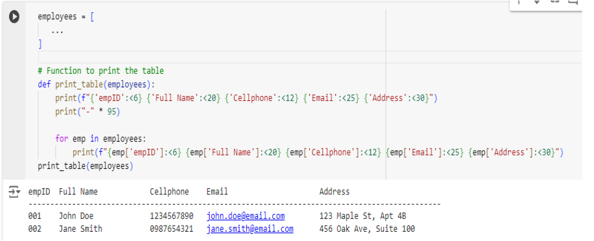

# TDI - Employee Contact Book Application (Due Date: 24/08/2024)

## Project Overview:
You have been assigned by your company to develop an 'Employee Contact Book' application. This application will function as a centralized system for securely storing and managing employee contact details, including names, phone numbers, email addresses, and addresses. The application must ensure that all contact details are unique, correctly formatted, and validated before being added to the database.

### Objective:
To develop a reliable, user-friendly Python application that manages and displays employee contact information while ensuring data accuracy and uniqueness.

### Requirements:
**Programming Language:** Python
**Knowledge:** Lists, tuples, dictionaries, string manipulation, input validation, basic error handling and functions.

### Project Structure:
1. **Employee Contact Management:**
    **Data Storage:**
- empID (string or number): A unique identifier for each employee.
- first_name (string): Employee's first name, which should contain only alphabetic characters.
- last_name (string): Employee's last name, which should contain only alphabetic characters.
- phone_number (string): Employee's phone number, which should contain only numeric characters.
- email (string): Employee's email address, which should be unique for each employee.
- address (string): Employee's address, which can contain special characters, numbers, and alphabets.

    **Input Validation:**
- Ensure that empID, phone_number, and email are unique for each employee.
- Validate that the first_name and last_name contain only alphabetic characters.
- Validate that the phone_number contains only numeric characters.
- Validate the format of the email to ensure it meets standard email structure.
- Allow address to contain special characters, numbers, and alphabets.
- Adding Employees: Before adding a new employee to the contact book, check if empID, phone_number, or email already exists. 
If a duplicate is found, display an appropriate message, such as:
        'Employee with employee number [empID] already exists.'
        'Phone number [phone_number] is already assigned to another employee.'
        'Email [email] is already in use.'

2. Displaying the Employee Contact List:
Develop a feature to print all employee contacts in a well-organized table format: 
See sample in the snippet below.
